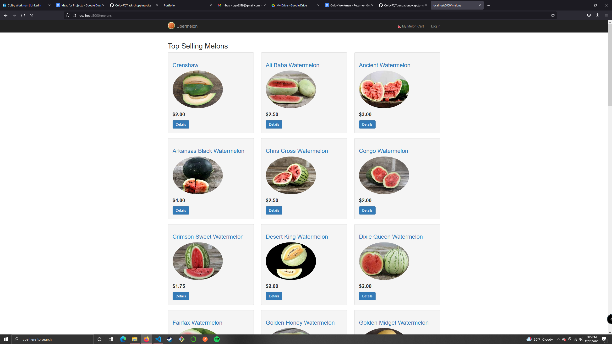
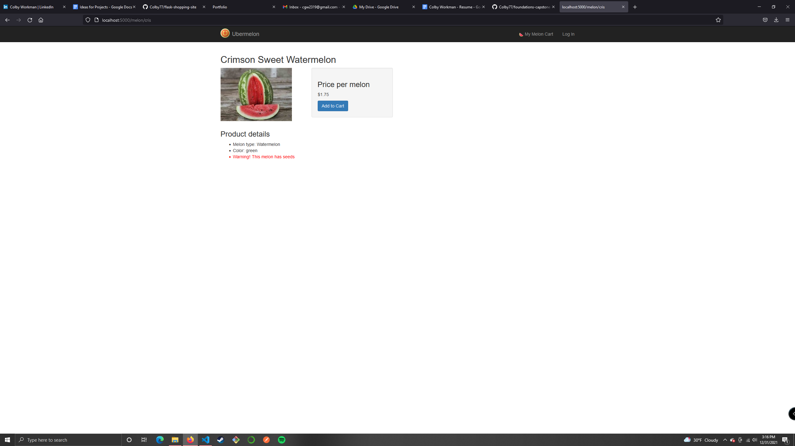
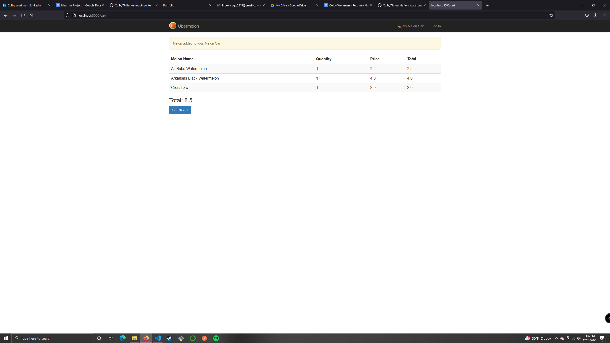

# Flask Shopping Site

## Description
A side project I made at Devmountain. It is a simple shopping website where users buy different types of watermelons

Users have a list of melons to buy on the page. The information from the melons comes from melons.txt.

Users can click a melon to get more information about and add it to the cart.  The cart's contents are persistent and saved in the session.

Users can login and logout.  The current logged in user is saved in the browser session, along with any melons they add to the cart.

List of users is in customers.txt

## Tech Used
    -Python and Flask
    -HTML/CSS

## Screenshots

